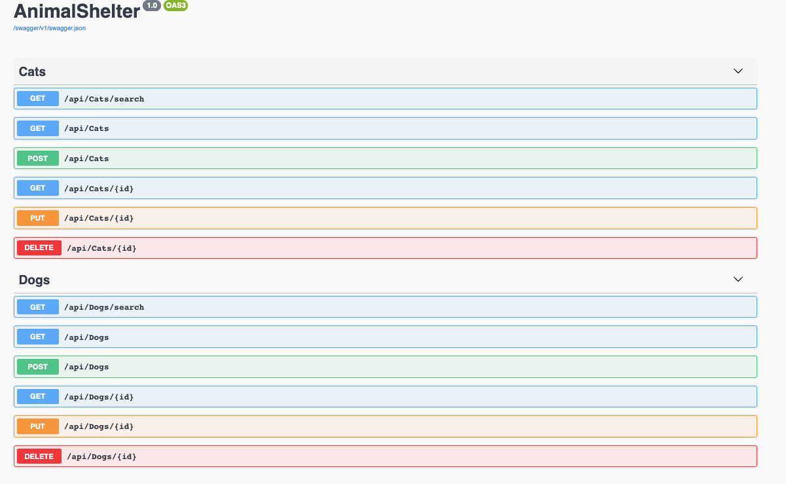
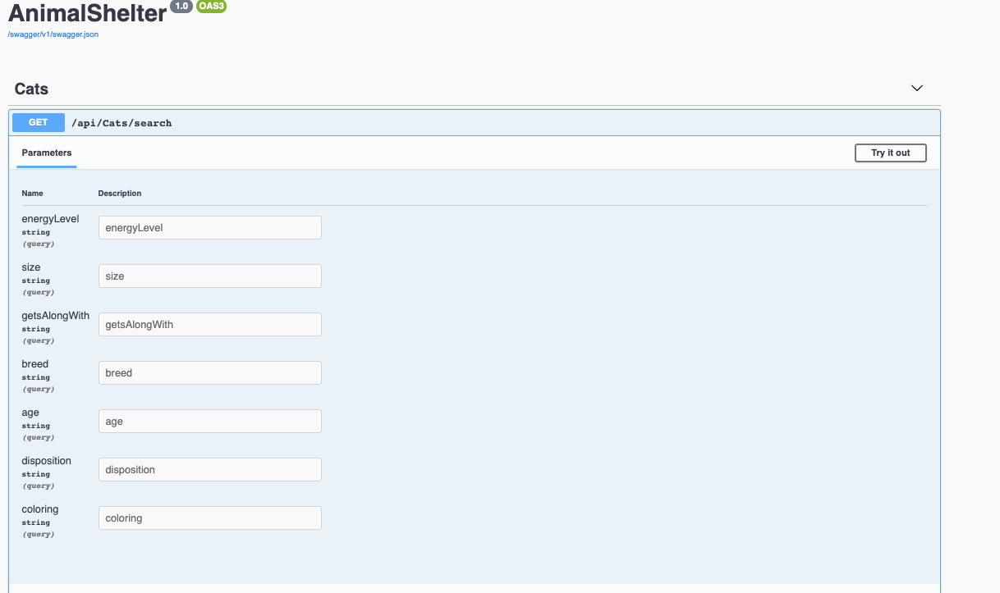

<h1 align="center">
  <br>
  <a href="https://www.github.com/MarielHamson/Animal-Shelter-API.Solution"></a>
  <br>
  Animal Shelter API
  <br>
</h1>

<h4 align="center">A backend API with multiple endpoints.</h4>

<p align="center">
  <a href="#key-features">Key Features</a> •
  <a href="#how-to-use">How To Use</a> •
  <a href="#reach-out"> Reach Out </a> •
  <a href="#credits">Credits</a> •
  <a href="#you-may-also-like">Related</a> •
  <a href="#license">License</a>
</p>

## Key Features

- Lists all animals ready to be adopted
- See a particular animal's details
- Edit a particular animal's details
- Delete a particular animal from the database
- Database seeded with sample animals
- Pagination of results (Default of 2 results per page at a time)
- Cross platform
  - Windows, macOS and Linux ready.

Stretch Goals:

- Implement tokenization and CORS

## How To Use

To clone and run this application, you'll need [Git](https://git-scm.com), [.NET Core 2.2](https://dotnet.microsoft.com/download) installed. If you wish to review the raw code, it's easiest to download a code editor such as Visual Studio Code or Atom. Additionally, you'll need [Postman]or similar(https://www.postman.com/downloads/) installed for querying the API but you can also navigate to https://localhost:5004/ for documentation via Swagger.

## Import Database using MySQL Workbench

### Clone this repository from your Command Line:

`$ git clone https://github.com/MarielHamson/Animal-Shelter-API.git`

- Open MySQL Workbench
- In the Navigator > Administration window, select Data Import/Restore
- In Import Options select Import from Self-Contained File.
- Navigate to the .sql file from the repository.
- Under Default Schema to be Imported To, select the New button.
- Enter the name of the database.
  In this case Mariel_Hamson.
- Click Ok.
- Click Start Import.
- Reopen the Navigator > Schemas tab. Right click and select Refresh All. Your new database will appear.

From your command line:

```bash

# Go into the repository
$ cd AnimalShelter.solution

# Open repository in VS Code or other
$ code .

# Install dependencies in Root Project Directory (AnimalShelter)
$ dotnet restore

# Run the app
$ dotnet run
```

## Using Swagger Documentation

-- Use Swagger to explore the documentation of this API. There are three endpoints, one for Cats, one for Dogs, and one for general Animals otherwise not mentioned. Launch the project using `dotnet run` with Terminal and then input`http://localhost:5004` into your browser. See below for endpoints and parameters:





Example Queries:

`http://localhost:5004/api/Animals/`
`http://localhost:5004/api/Cats/`
`http://localhost:5004/api/Dogs`

## A Note On Pagination

- To modify the default pagination of 2 results per page, append the following parameters: `pageSize=`. If you would like to skip to a certain page of results, use the `pageNumber=` parameter.

## Reach Out

The Animal Shelter is an [emailware](https://en.wiktionary.org/wiki/emailware). Meaning, if you liked using this app or it has helped you in any way, I'd like you send me an email at <mariel.hamson@gmail.com> about anything you'd want to say about this software. I'd really appreciate it!

## Credits

This software uses the following technologies:

- C# / .NET
- Entity
- MySQL / MySQL Workbench
- Okta tokenization
- Postman
- Swagger

## Support

<a href="https://www.buymeacoffee.com/" target="_blank"></a>

<p>Or</p>

<a href="https://www.patreon.com/">
	
</a>

## You may also like...

-- Other projects in my GitHub Repository

## License

MIT

---

> LinkedIn [MarielHamson](https://www.linkedin.com/MarielHamson) &nbsp;&middot;&nbsp;
> GitHub [MarielHamson](https://github.com/MarielHamson) &nbsp;&middot;&nbsp;
> Instagram [Miriquitecontrary](https://instagram.com/miriquitecontrary)
